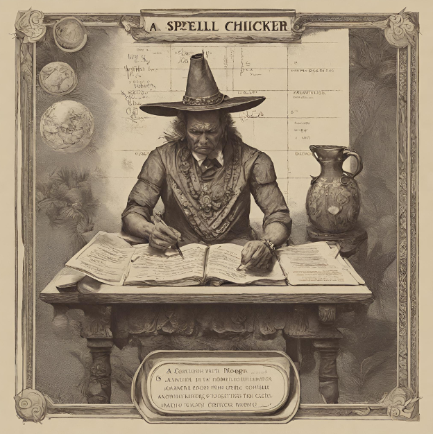

## Aprendizaje automático: Diseño de un corrector ortográfico

Taller para la [**VII Edición  del  Congreso  de  Estudiantes  de  Ingeniería**](http://congresoingenierias.unicaribe.mx/index#inicio) 

[*Universidad  del  Caribe*](http://unicaribe.mx). 

Impartido por Olivia Gutú [`olivia.gutu@unison.mx`](olivia.gutu@unison.m)

Para iniciar el taller, puedes abir el material desde *Colaboratory* de *Google* [en este enlace](https://colab.research.google.com/github/mcd-unison/corrector-ortografico/blob/main/Taller.ipynb)

